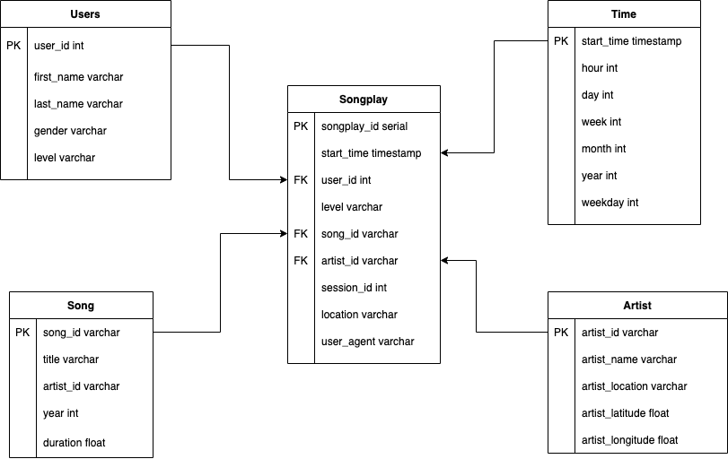

# Project Data Lake

## Goals

A music streaming startup, Sparkify, has grown their user base and song database and want to move their data warehouse to a data lake.

As their data engineer, I'm tasked building an ETL pipeline that extracts their data from S3, process them using Spark, and loads the data back into S3 as set of dimensional tables. This will allow their analytics team to continue finding insights in what songs their users are listening to.

## Design of Fact & Dimensional Tables For Song Play Analysis
The design of dimensional table for song play analysis is written below.
The ETL process using Spark converts from the original data into fact and dimensional table as parquet files that can be used by pyspark analysis.
The process is supposed to be done on EMR cluster in order to process the original data in parallel.

* Fact Table

	1. 	songplay - records in event data associated with song plays i.e. records with page NextSong

* Dimension Tables

	1. users - users in the app
	user_id, first_name, last_name, gender, level
	2. song - songs in music database
	song_id, title, artist_id, year, duration
	3. artist - artists in music database
	artist_id, name, location, lattitude, longitude
	4. time - timestamps of records in songplays broken down into specific units
	start_time, hour, day, week, month, year, weekday

## Files Included in the REPO:

* etl.py: The script of ETL process that convert logs data into parquet files that is formed as dimensional table to be used for song played analysis. The process will be process on the EMR cluster, ideally.
* dl.cfg: The information of AWS programmatic access is written, supposedly.

## Steps to run the projects:

1. The original data resides in "s3a://udacity-dend/"
2. Execute the "python etl.py" file in the Terminal to run the ETL pipeline of converting the original data into dimensional table parquet file.
